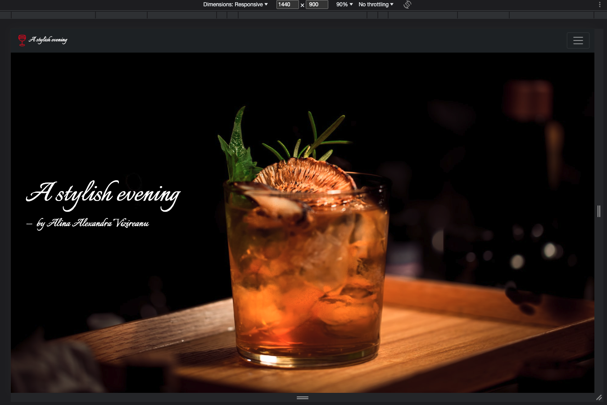
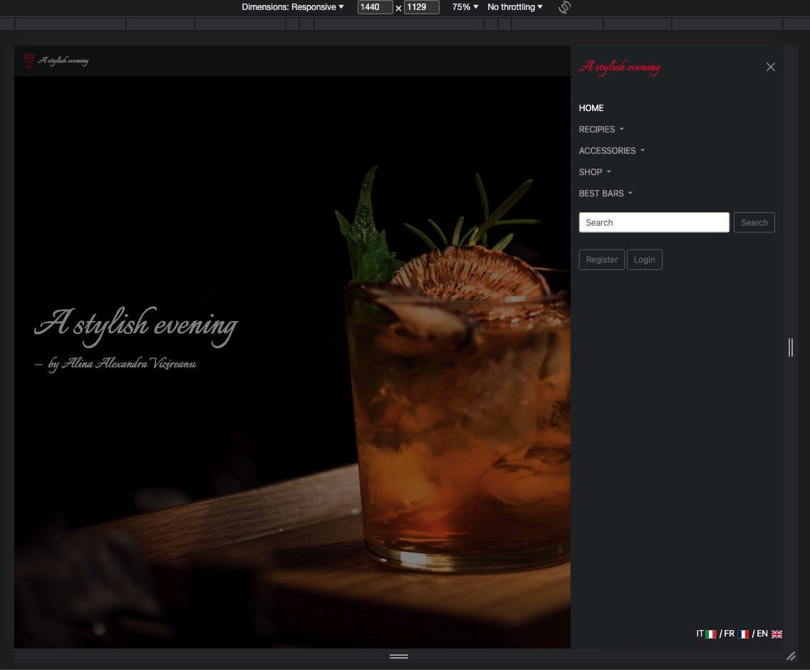
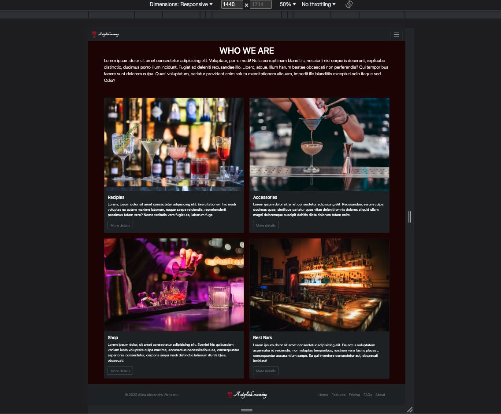

# Cocktail Bar landing page built with Bootsrtap

## Table of contents

- [Overview](#overview)
  - [The challenge](#the-challenge)
  - [Screenshot](#screenshot)
  - [Links](#links)
- [My process](#my-process)
  - [Built with](#built-with)
  - [What I learned](#what-i-learned)
  - [Useful resources](#useful-resources)
- [Author](#author)
- [Acknowledgments](#acknowledgments)

## Overview

A responsive website for a cocktail bar.

### The challenge

Users should be able to:

- View the optimal layout for each page depending on their device's screen size
- See hover states for all interactive elements on the page

### Screenshot

### Links

- Solution URL: [Solution URL here](https://github.com/AlinaAlexandraVizireanu/Bootstrap-Projects)
- Live Site URL: [Live site URL here](https://alinaalexandravizireanu.github.io/Bootstrap-Projects/)

## My process

The process of building this landing page started with sketching the design and then building it with HTML, CSS, Bootstrap and Flexbox.

### Built with

- Semantic HTML5 markup
- CSS custom properties
- Flexbox
- [Bootsrtap](https://getbootstrap.com/)

### What I learned

During my process of building this website I've learned a lot about Bootstrap and positioning elements with Flexbox.

### Useful resources

- [Bootstrap Documentation](https://getbootstrap.com/docs/5.3/getting-started/introduction/) - This helped me for XYZ reason. I really liked this pattern and will use it going forward.

## Author

- Website - [Vizireanu Alina Alexandra](https://alinaalexandravizireanu.github.io/Bootstrap-Projects/)

## Acknowledgments

At the time I've completed this project I was enrolled in the Web Developer Bootcamp by Colt Steele which is a great teacher who inspired me to learn more about both Flexbox and Bootstrap.
